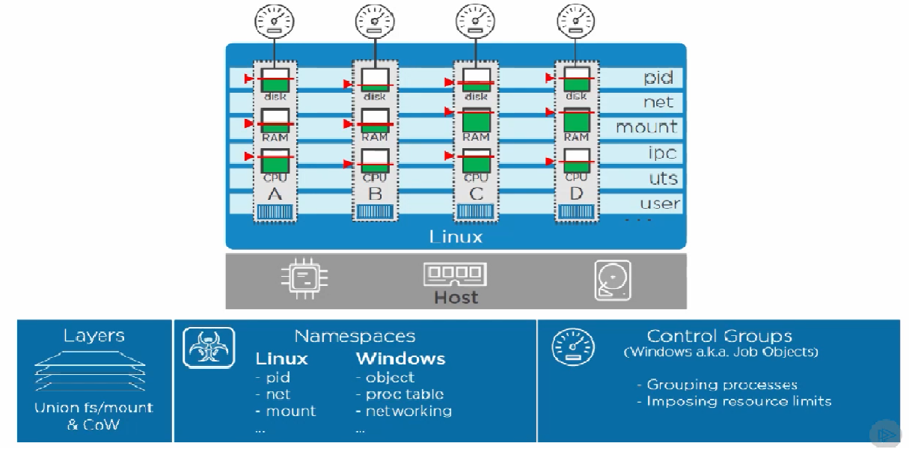
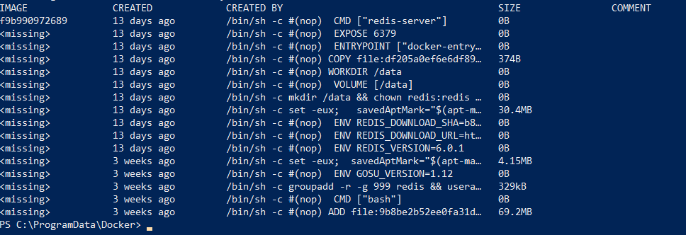

# Docker

Containers
-
- Containers are all about applications. 
- A container is an isolated area with resource usage limits applied. 
- A container maintains this isolation using kernal's name spaces and control groups.
- Name spaces and control groups are present since the evolution of unix/linux OS, but they remained obscure because of the complexity. Docker Engine makes this very easy.
 

Docker Engine
-
- Docker Engine is modular.
- We interact with Docker engine either through CLI or api. Under the hood Docker engine consists of various parts like docker daemon, containerd, OCI etc.
- The command `docker container run...` to start the container, it makes a call to the api `/containers/create` in the docker engine.
- Docker engine gets all the kernal stuff like control groups and name spaces and start the container.

Namespaces and Control Groups
-
- Linux containers are around even before docker. To make them working one must be an expert on the kernal.
- Name spaces and Control groups are two major building blocks for building containers.
- These two are linux kernal primitives, and now they are available on windows aswell.
  - Namespaces
	- Name spaces are about isolation and Control groups are about grouping objects and setting limits.
	- Name spaces split the Host OS into multiple isolated virtual OS's like hypervisors.
	- With hypdervisor a single physical machine resources like CPU, RAM, disk storage, networking are split into multiple VM's, such that each VM has its own Virtual CPU, Virtual RAM, Virtual disk storage, Virtual networking etc.
	- In container world, name spaces use HOST OS resources which are high level constructs like file system, process trees and users and turn them into multiple OS's called containers.
	- Each container gets it's own file system, process tree, root user etc, but share the same OS.
	- In Linux world namespaces are collection of 
	  - Process ID(pid): Each container has it's own process tree with its own pid 1. 
	  - Network(net): Each container has it's own ipaddresses, route tables etc.
	  - File system/mount(mnt): Each container has it's own root file system `/` or `C:\` 
	  - Inter-proc comms(ipc): Each container gets it's own shared memory isolated from other containers.
      - UTS(uts): Every container get's its own hostname.
	  - User(user): Specific to docker, to provide different privileges to different users with in the container.
  - Control Groups(In windows Job objects)
	- Control groups are used for grouping process and imposing resource limits like amount of CPU, RAM , disk storage.

Images
-
- Image is a read only template for creating application containers. 
- Typical Image consists of OS files/objects, app files, manifests etc.
- Images are build-time construct, whereas containers are run-time siblings.
- An image is a bunch of layers stacked up on one another.
- An image can be used to run multiple containers from it.
- Images are stored in a registry(on-premise or cloud) and later can be pulled on to the hosts(`docker pull image-name`) in which container needs to be run.

Images in Detail
-
- To get image from registry use the command `docker image pull` or `docker pull`. For ex: `docker pull redis`.

- An image is a bunch of independent layers that are loosely coupled by a manifest file. So, an image is not a single blob file.
- A manifest file describes the image like id, creation time and most importantly the list of layers that it stacks.
- The layers are unaware of the bigger image. So, one layer of an image has no reference to the other.
- To support multi architecture support and content addressable storage, Pulling a docker image consists of two parts.
  - Get manifest: Fat manifest and image manifest
  - Pull layers

Manifest
-
- There are two types of manifest
  - Fat manifest
    - Contains details about the list of architectures supported and a manifest for each of those.
	- `docker pull` gets the fat manifest and verifies if the fat manifest contains the host system architecture in the list of supported architectures.
  - Image manifest
    - If fat manifest supports the host system architecture, then image manifest is pulled.
    - Each of the layers present in the image manifest is pulled from docker registry's blob store as shown in the image below.
	- To look at content of manifest `docker inspect imageName/imageId`

Content addressable storage
-
- Earlier docker did not hash it's images and there was no easy way to know if the image that is pulled from registry is right.
- Docker 1.10 introducted CAS(content addressable storage)
- CAS hashes all of the content in the image and use that as image id, so when we pull image from registry, we run the hash of it and verify if it matches the image id.
- The image manifest shows path locations where the image data is stored.

Layers
-
- Base Layer
  - This is the OS layer which contains the files and os objects used to build the basic OS like ubuntu etc. If the docker container uses ubuntu, it will have common ubuntu tools and file system utilities etc. So, it is totally possible to run a centos docker host with ubuntu based containers on it. 
  - It is going to be Linux containers on Linux host and Windows containers on Windows host on Kernal(This is not applicable for Hyper-V containers).
- App Layer
  - On top of Base Layer, there will be bunch of other layers which are required to run the application like program runtimes(jvm), build tools(maven), servers(tomcat), updates etc.
- Each of the layers are present in the directory /var/lib/docker/aufs/diff for linux, for windows C:\programData\docker\overlay2\diff.
- When building images some of the commands build new layers and some of them add content to the image config file. 
- The command `ls -l /var/lib/docker/aufs/diff` all layers as shown below.

  

- The command `docker history imageName/imageId` shows the commands that formed the image.

  

- To remove the docker image `docker rm imageName`

Registries
-
- Images are pulled from registry to docker host.
- The default registry for docker is dockerhub. Other registries are available from google, amazon also.
- Docker provides an on-premise registry called Docker trusted registry(DTR) with it's enterprise edition.
- Docker maintains a local registry on each docker host. The path of local registry for linux is /var/lib/docker/storage-drive and for windows C:\programData\docker\windowsfilter.
- Docker registry maintains two levels of images.
  - Official images
    - These images reside at the top level of hub namespace(docker.io)
	- We name these images redis, nginx etc, but they are actually not the images.
	- The actual image name can be identified with REGISTRY/REPO/TAG
	  - Registry can be docker hub, google, amazon etc.
	  - Repo's can be redis, nginx , fedora, ubuntu etc.
	  - Tag's are the original images. In the redis ex, tag name is `latest`.
	  - Registry defaults to docker hub, tag defaults to latest if we don't mention explicitly.
	  - Full command to pull image is `docker pull REGISTRY/REPO:TAG`. For ex, `docker pull docker.io/redis:4.0.1`
	  - An image can have different tag ids. For ex, if latest version of redis is 4.0.1, then both will refer to the same image id.
  - Unofficial images
	- These images reside inside an organization name or an user name.
	- The unofficial images reside at /REGISTRY/(ORG_NAME/USER_NAME)/REPO/TAG
	- The command used to pull these images `docker pull (ORG_NAME/USER_NAME)/REPO:TAG`. For ex, `docker pull tulasiramdamarla/helloworld:1.0`.
- Pushing images to the registry
  - Each of the layers in an image contains data. For each layer a hash is computed using its content, which is nothing but the layer id. This is called as content hash.
  - When pushing images, we define a manifest that defines the layers in it and push the manifest and layers independently.
  - Distributed Hash
    - When pushing the layers over internet, they are compressed. As we know, layer id's are content hashes, when the data is compressed it's content will be changed. So, when these arrive at registry, verification fails.
    - To get around the problem of hashes, when maifest is created layers are compressed and new hash is created. This hash is called distributed hash.

Dockerfile
-
- `Dockerfile` is a list of instructions to build an image with the runtime required along with application inside.
- It is a convention to write all docker instructions in capital.
- An instruction if of the format `<Instruction> <value>`.
- Dockerfile always start with the `FROM` instruction which defines the base image.
- It is a good practice to list maintainer.
- Use `RUN` command to execute a command and build a layer.
- Use `COPY` command to copy code into image as a new layer.
- Some instructions like `WORKDIR` can add metadata to image configuration instead of creating layers.
- Use `EXPOSE` command to expose the port out of docker container.
- Use `ENTRYPOINT` to start the application inside the image. `ENTRYPOINT` executes the command(first argument) with options(second argument). `ENTRYPOINT` command options are relative to the `WORKDIR`.
- Let's see an example on how to write a Dockerfile for a node application.

		# Test web-app to use with Pluralsight courses and Docker Deep Dive book
		# Linux x64
		FROM alpine

		LABEL maintainer="tulasiram.damarla@gmail.com"

		# Install Node and NPM
		RUN apk add --update nodejs nodejs-npm

		# Copy app to /src
		COPY . /src

		WORKDIR /src

		# Install dependencies
		RUN  npm install

		EXPOSE 8080

		ENTRYPOINT ["node", "./app.js"]  
  
Build Image and Run the container
-
- To build the image with `Dockerfile` use the command `docker build -t imageName /path/to/appcode`. Ex: `docker build -t myImage .`. `-t` represnt tag.
- To build the image using the build context from a remote location like git, Use command `docker build -t imageName gitURL`. Ex:`docker build -t psweb https://github.com/tulasidamarla/psweb.git`. 
- To run the container use the command `docker run -d --name containerName -p HOST_PORT:CONTAINER_PORT imageName`. Ex: `docker run -d --name testApp -p 8080:8080 myImage`
  - `-d` to run the container in detached mode. `-it` for interactive mode.
- To remove an image `docker rmi imageId`.  
  
Multi-stage builds
-
- Smaller images are better because it results in faster builds and deployments. So, minimal OS and package sizes are better.
- Multi-stage builds are helpful to seperate the build contstructs so that our development environment build images are different from production interms of image layers and size.
- Multistage Dockerfile can be seen in the image below.
- Each stage can be give a name using `AS` command as shown above.
- The base image used for stage storefront(node:latest) is big in size. This is used for building the application. The resulting image has all layers of the stage.
- The base image used for stage appserver(maven:latest) is also big, which contains image along with the build tool maven. This image is used to build the java application code and the resulting image has all layers including java runtime, maven build tool etc.
- The base image for stage production is small in size. The subsequent layers have added some configuration to the base image. `COPY` command at line:17 copies the static build code from the `storefront` stage and adds an additional layer. `COPY` command at line:19 copies the java jar from the stage `appserver` and adds an additional layer.

Multistage build Demo
- 
- Multi-stage Dockerfile demo code can be found at https://github.com/tulasidamarla/atsea-sample-shop-app.
- change directory to app and execute the build command `docker build -t multistage .`
- In the below image, we can clearly see multi-stage image size is lessthan the following two images.

Working with containers
-
- Containers are the atomic(smallest) units of scheduling. In Virtualization world it is `VM`, in Kubernetes world it is `Pod`, in docker world it is `Container`.
- If we want to run an app, we run it as one or more containers. So, containers are running instances of images.
- Images are a combination of one or more read-only layers. Containers have a thin writable layers lashed on top during run-time along with the read-only layers of the build-time. Any changes made while containers running are written to the write layer. Each container maintains a read-only copy of image and any changes required to it will be written on the write layer. 
- Writing to containers happens with the help union file systems(ufs) and union mounts. 
- Stopping a container is similar to stopping a VM. All of its content is persisted.
- Containers have a life cycle. We can start, stop and delete a container.
- When a Container is stopped, its current state is saved. It means, any changes happen to container while it is running are preserved. 
- Working with commands
  - To list running containers `docker container ls`.
  - To list all the containers including the stopped ones, `docker container ls -a`.
  - To run container in interactive mode `docker container run -it imageName CMD`. For ex: `docker container run -it alphine sh`.
  - To quit the container without terminating it, CTRL+p+q
  - To stop a running container `docker container stop continerId`.
  - To restart a stopped container `docker container start containerId`.
  - To login into an existing container `docker container exec -it containerId CMD`. For ex: `docker container exec -it 800b57c27c5c sh`.
    - If we don't mention the CMD, container will run and logs into the default process as mentioned in the image manifest's CMD. To know about this default process of an image use `docker inspect` command.
	- Any run-time arguments provided as part of `docker container` command, will override the `CMD` instructions present in the image whereas Any run-time arguments provided for `ENTRYPOINT` are appended.
  - To execute commands on a running container without logging in `docker container exec containerId CMD`. For ex: `docker container exec 800b57c27c5c ls -l`.
  - To delete a container `docker rm containerID`, use `-f` for force remove.
  - To remove all the containers `docker container rm $(docker container ls -aq) -f`.
  - To view all the ports of a running container `docker port containerId`.
  
Logging
-
- There are two types of logs.
  - Daemon logs
    - Most linux systems use `systemd`, so we can read these logs using `journalctl` command. For ex: `journalctl` -u docker.service`
	- For non systemd linux systems, check them at `/var/log/messages`.
	- For Windows, `~/AppData/Local/Docker` or can verify them at windows event viewer.
  - Container logs
    - Container logs are the application logs. Docker expects application logs to be `STDOUT` and `STDERR`. Docker captures pid1 of every container is captured and forwarded. So, design the containers in a way that applications run as pid1.
	- If application logs are written to a file, symlinks can be written for those files, so that logs can be written to STDOUT and STDERR`.
	- Mount the location of log files, so that logs can be preserved even if the container is stopped or deleted.
	- Logging drivers
	  - Since Docker 17.x, docker enterprise edition(EE) has provisioned logging drivers.
	  - Logging drivers are plugins, which are useful for integrating container logs to the existing logging solutions like Syslog, Splunk, Gelf, Fluentd etc.
      - we can configure the default logging driver using `daemon.json` file, so any containers started will use that driver.
	  - If we want to override the default driver options for each container, the command line arguments `--log-driver` and `--log-opts`.
  - To view logs `docker inspect containerId`.
  
Swarm
-
- Despite the raise of `Kubernetes`, swarm is at the heart of everything that docker is doing. Swarm has two parts namely `Secure cluster` and `orchestration`.
- `Secure cluster` part is at the central to the future of docker.
- Swarm is also central to the native support of `docker` to `kubernetes`.
- Secure Swarm Cluster
  - `Swarm cluster` contains group of docker nodes(or hosts), which are all secure.
  - In swarm, a docker node can either be a manager or a worker.
  - Swarm get mutual TLS, where workers and managers mutually authenticate with one another and all of the network chat is encrypted.
  - Swarm has a cluster store which is encrypted and is distributed to all managers.
  - Once `Swarm cluster` is formed, then we can schedule to start running containers in it. So, instead of running individual `docker run` commands to run containers, we can give commands to the cluster. Swarm will decide where to run the containers and does the work load balancing. 
  - Two types of work that can be done on `Swarm cluster`, namely `Native swarm work` and `Kubernetes work`. 

Swarm In Detail
-
- Docker installation comes with lot of tools like containerd, Swarmkit etc, bundled together. Docker bundles all of these different tools and gives an integrated slick api. The source code for swarmkit can be seen at https://github.com/docker/swarmkit
- Before docker 1.12, swarmkit was a seperate project. Since docker 1.12 it is integrated into docker.
- From docker 1.12 onwards, we can run docker in `single-engine` mode ro `swarm mode`.
  - In single-engine mode, we need to work with each docker node seperately.
  - In `swarm mode`, we don't need to login to each node to run and manage containers.
    - Any node running as part of `swarm cluster` is in `swarm mode`.
	- To verify if a node is present in `swarm mode` use the command `docker info`.
- To initiate a `swarm cluster` or to join an existing `swarm cluster`, use the command `docker swarm init`. This command will flips a docker node into `swarm mode`.
  - If a docker node initiates a `swarm cluster`, it automatically becomes the first manager of the cluster and also becomes the `leader`.
  - This leader manager node also becomes the Root certifcate authority(CA) of the `swarm cluster`. This also issues a client certificate and builds a secure cluster store(etcd) and automatically distributed to every other manager in the node and it is encrypted.
  - We can configure external CA with the command `docker swarm init --external-ca ${external-ca}`.
  - The `swarm cluster` creates a default certificate rotation policy of 90 days.
  - The `swarm cluster` also creates set of cryptographic join-tokens, one for joining new managers and other for joining new workers as shown below when running `docker swarm init`.

		PS C:\ProgramData\Docker> docker swarm init
		Swarm initialized: current node (6vns2mfg2do7ia00bhpos7i55) is now a manager.

		To add a worker to this swarm, run the following command:

		docker swarm join --token SWMTKN-1-00ab7xrtthkmibfk4e81n3xgjrwu7veq5yua6nr2563jraa9ud-63q4ih87jwx6ph4usb94m2dl8 192.168.65.3:2377

		To add a manager to this swarm, run 'docker swarm join-token manager' and follow the instructions.

  - To join a new manager to an existing `swarm cluster`, start docker in single-engine mode and execute the command `docker swarm join` as shown above.
  - Swarm Cluster Managerment
    - Swarm managers are configured for high availability. It is handled by RAFT.
	- Best practices for HA is to go with odd numbers like 3,5,7 and also to keep the number mininum. So, anything beyond 7, it may end in consuming lot of timing in making decisons. 
	- Best practices for HA also is to have fast and reliable networks. For ex, if we use aws, don't keep these managers across regions, as interactions among managers may not reliable. But, it is ok to keep them in different availability zones in a region.
	- Every `swarm cluster` has one `leader manager` and `follower managers`. 
	- Commands can be issued to any manager.
	- If a leader fails, other leader manager is elected from followers.
    - `Swarm cluster` can have mix of linux and windows worker nodes.
	- Worker nodes will not have access to cluster store, but they will have the information about all the manager ips. 
	- Each worker node gets a certificate from leader manager.
    - To summarize, Creating a swarm cluster with `docker swarm init` does the following steps.

Swarm Demo
-
- After creating docker swarm, `docker info` shows the information of swarm like cryptographic id, Raft, CA configuration etc, as shown below.

- `docker swarm join-token manager` on the leader node, gives information to join `swarm cluster`. Switch to the other node and execute the highlighted command shown in the below image.

- `docker swarm join-token worker` on any leader node, gives information for a worker node to join `swarm custer`. Switch to worker node and start docker in single-engine mode and execute the command to join `swarm cluster`. Worker node can be anything. It means, a linux `swarm cluster` can have a windows worker node. So, swarm can have hybrid cluster.
- `docker node ls` command from any of manager nodes gives the information of all the nodes in the `swarm cluster`. The manager leader has the manager status `Leader`, follower have manager status `Reachable` and worker nodes status would be left blank as shown in the below image.
- `docker node ls` command will not work from worker nodes.

- Tokens for all workers can be rotated with the command `docker swarm join-token rotate worker`. This gives new worker token without affecting the existing worker nodes. But, any new worker should use this new token to join the `swarm cluster`. 

- To look at the clients certificates and other certificate information from any manager node, we can use the command
`sudo openssl x509 -in /var/lib/docker/swarm/certifcates/swarm-node.crt -text`. In the certificate screen shot below, Organization in the Subject field refers to `swarmId`, organization unit(OU) refers to the node role and canonical name(CN) is the cryptographic node id.

- Join token
  - Join token contains three parts.
  - Token identifier
  - hash of the cluster certificate (Used for mutual authentication among `swarm cluster` nodes)
  - Identification of Worker/Manager
  - As shown in the below image, the last section of bits are the ones, that distinguish between worker and manager.
  
  
  
Autolock
-
- Auto lock prevents restarted managers from automatically rejoining the `swarm cluster`.
- It also prevents accidentally restoring old copies of the swarm.
- Auto lock is not enabled by default.
- To auto lock new `swarm cluster` use the command `docker swarm init --autolock`.
- To auto lock an existing `swarm cluster` use the command `docker swarm update --autolock=true`.
- once locked using any of the above commands, it gives an unlock key. Need to keep this safe if we want to unlock the `swarm cluster` in the future. 

  

- To rejoin the swarm, it needs to be unlocked first as shown in the below image.
 
  

- To update the certificate expiry for say 2 days, use the command `docker swarm update --cert-expiry 48h`.

 

